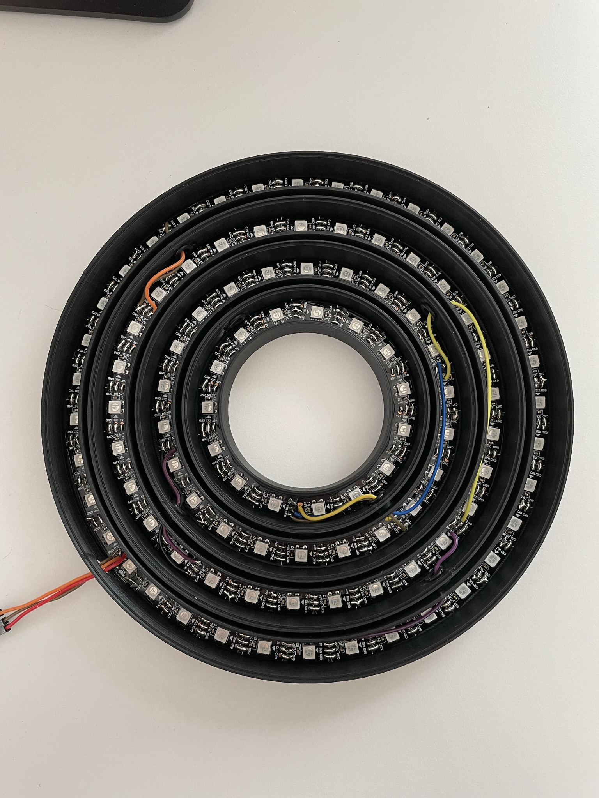
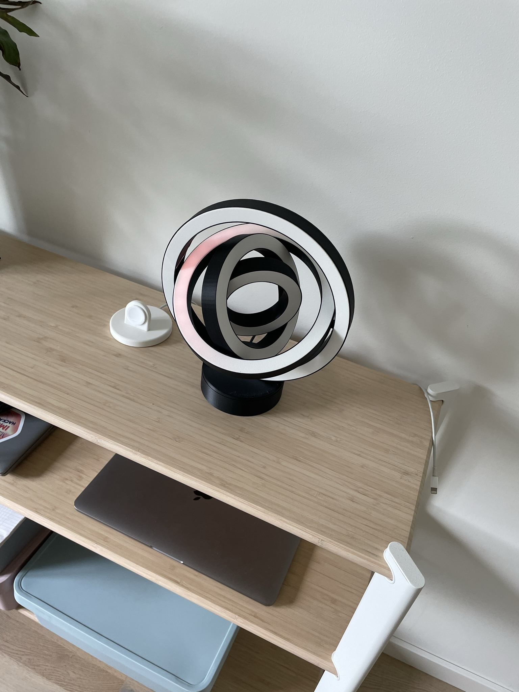

# Circle lamp

## Hardware
The LEDs used are just cheep WS2812B and they are connected to a Wemos D1 Mini

## Software
I use [WLED](https://kno.wled.ge/) for all my LED projects and this is no exception.

## Design

I took my inspiration from [this](https://www.darklightdesign.com/media/15046/henri-b612-wooden-pendant-3.jpg?anchor=center&mode=crop&width=1060&height=1060&rnd=132454389560000000)

I wanted to be able to print all the rings without having to print each ring in multiple parts so the biggest ring is 220mm and that decided the rest of the rings size.

There's a 5mm offset between each of the rings and that's just enough for the rings to be able to spin freely.

The rings are attached to eachother with these pins:

These goes through the inner rings and then spacer and into the outer ring. This works really well and I just superglue the pins to the inner ring after mounting.

The LEDS for this project we're glued to a inserts 1mm smaller than the inner diameter and then soldered and slotted into their rings.

The wiring got a bit weird because of the 90 degree offset between each ring. Therefore I had to run a signal wire within each ring which looks a bit weird. Power and ground were easier, I just tapped into the closest LED and threaded it through.

I was planning to make some sort of angle stop in order to stop the rotation from destroying the wiring but I was to lazy and I wont be spinning this around so that's for V2.

I'm pretty pleased with how the finished result turned out and dont have too many remarks that could be improved in a V2 other than cleaner wiring and an angle stop.