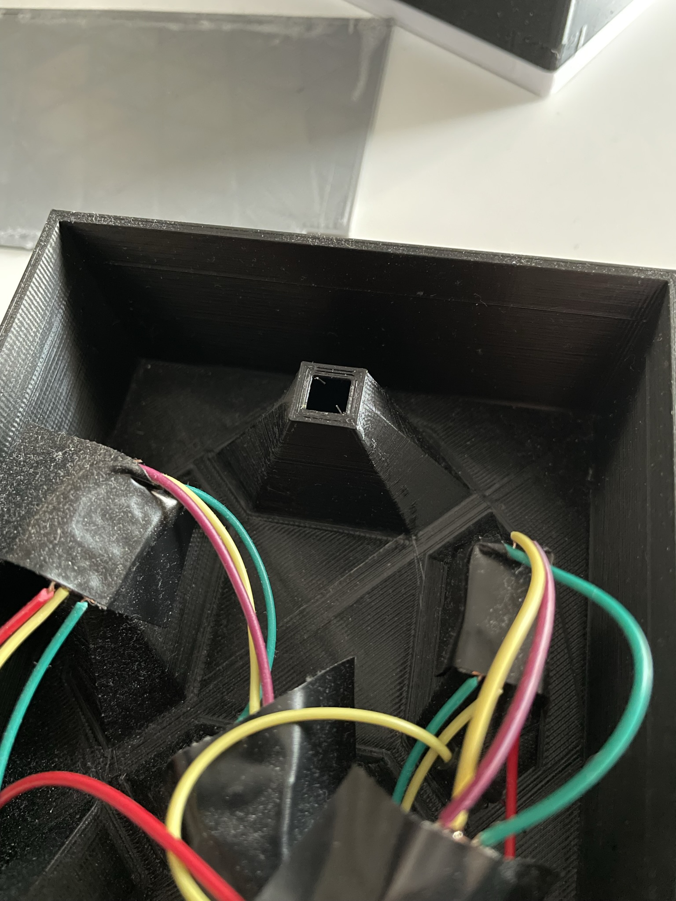
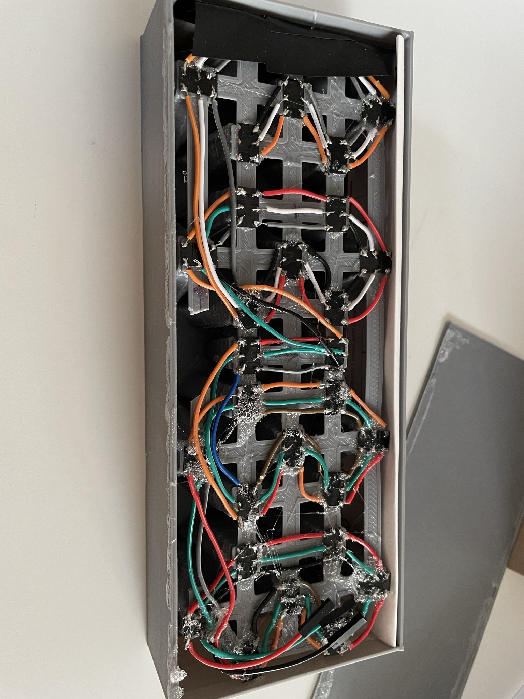
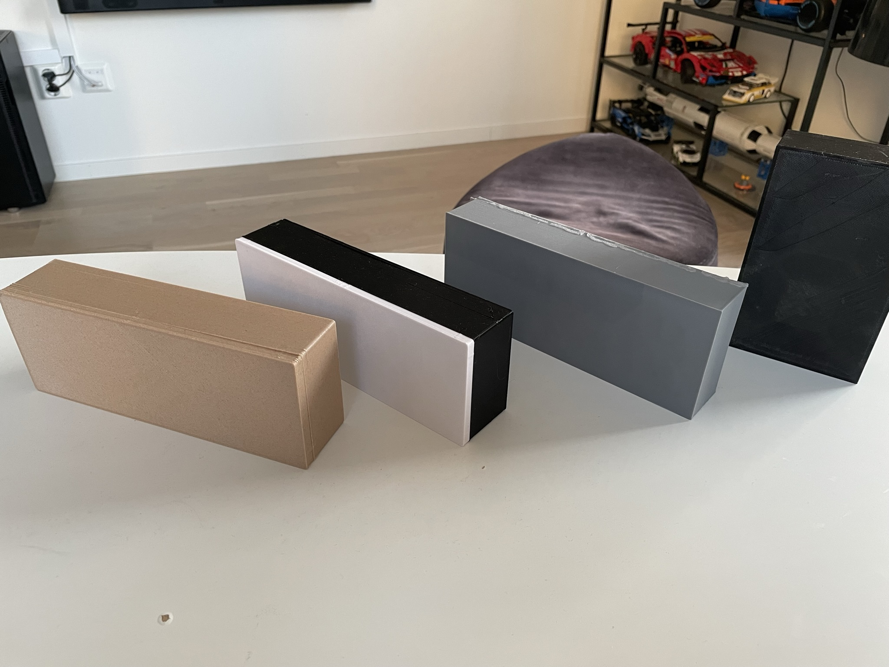
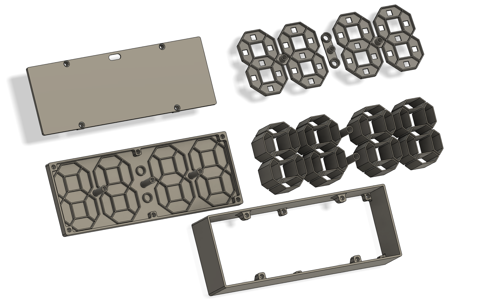
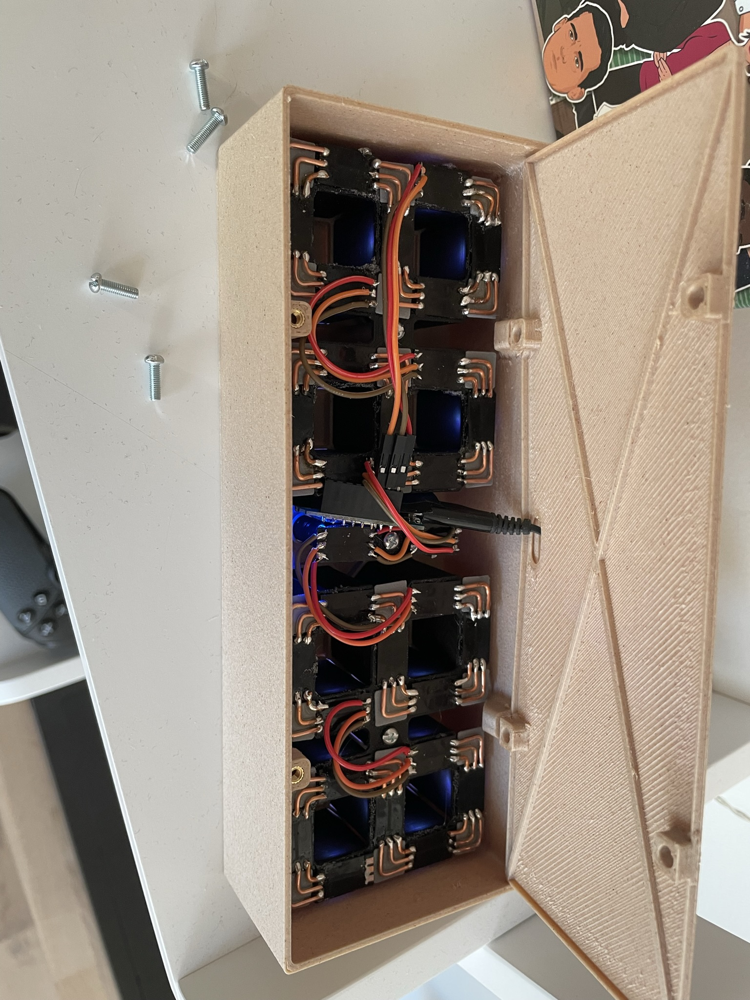
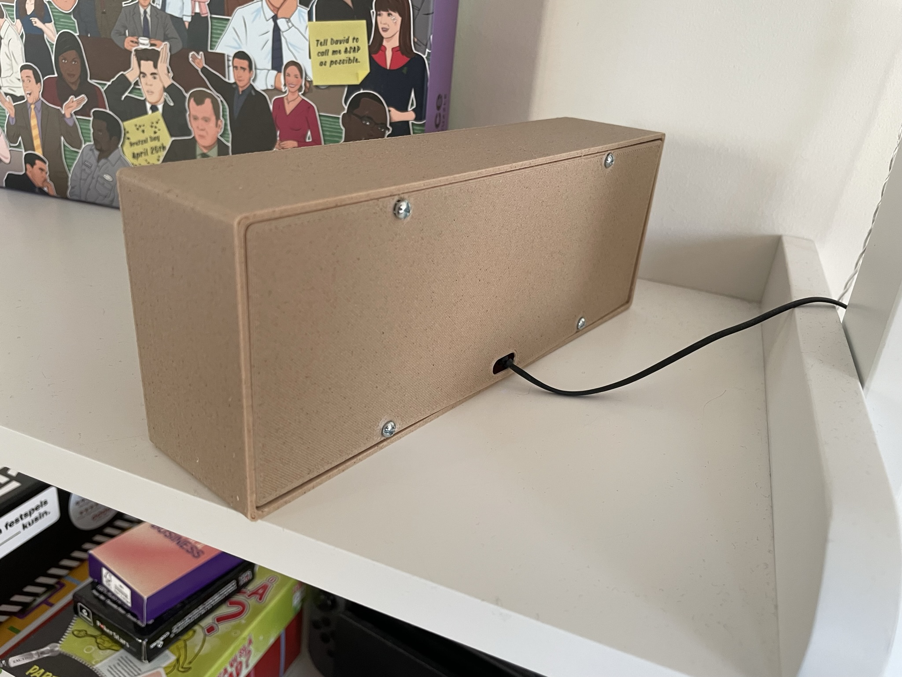
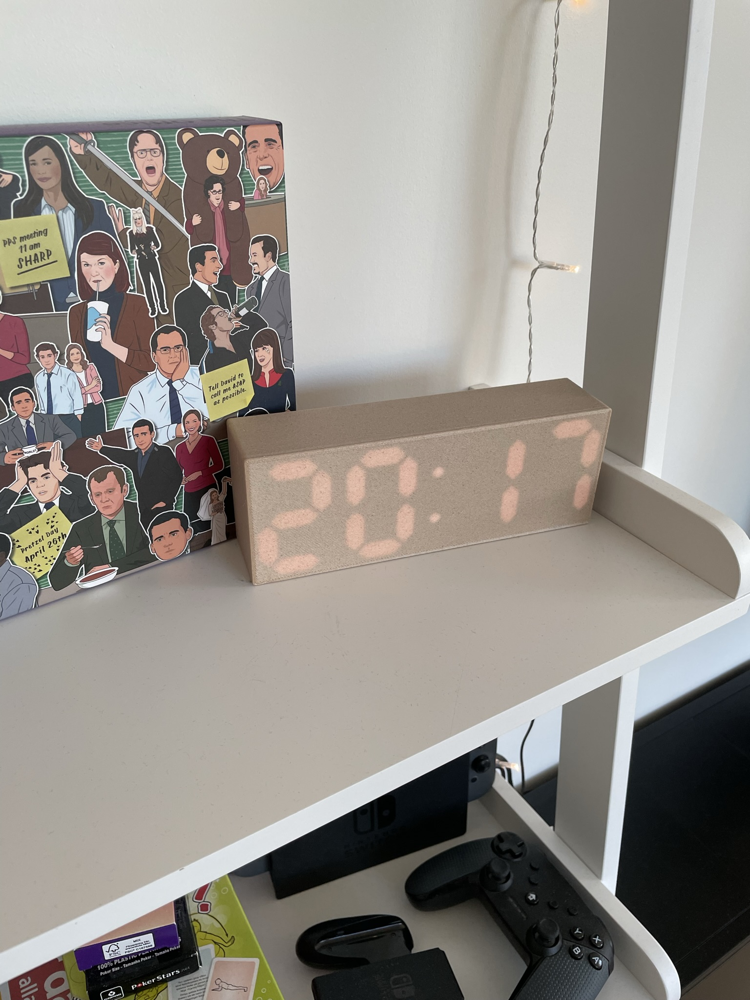

# See Through Clock

## Hardware
The LEDs used are just cheep WS2812B and they are connected to a Wemos D1 Mini

## Software
I use [WLED](https://kno.wled.ge/) for all my LED projects and this is no exception. It's simple to use and in this case I had to compile it myself in order to use [this ](https://github.com/Aircoookie/WLED/tree/main/usermods/seven_segment_display_reloaded) usermod.

## Design

This is a clock I made when trying to learn how to use Fusion 360.

I got the inspiration from seeing a few posts on thingiverse like [this](https://www.thingiverse.com/thing:2968056) but I always disliked the way you could see the segments even if they where off.

So I started to test how many layers was the sweet spot for light to be visable but still hide most of the imperfections from the 3D printer since my Ender 3 Pro couldn'r print perfect layers all the time.

On the final print I used 3 layers and printed the front and back in Addnorths PLA Wood.

I went through a few iteration before settling on the final design for how to mount everything together. 

My first plan was to print everything except the back in one part and use sloped shrouds that I could glue the LEDs into. I think this approach is the best if you have printer that you trust but I could not get this to print reliably without stringing inside the shrouds. (When I get a better 3D printer I think I will revisit this project and try a full scale version of this)

I tried making a full scale version like this because I just wanted to see if this was something even worth spending more time on. I made a thinn part where I glued all the LEDs to because I thought that might have been easier (It wasn't). I then glued this part to the front and voila, I made something!

*It looked like shit.* But it was **my** shit! 

I used it like this for a while but on a few of the segments you could see problems in the print and I couldn't ignore it. I also printed it on a glass bed because of a better first layer finish but the reflections it caused was quite annoying so I skipped that for v2.

Moving to v2 (black and white one) I tried to make it into even more parts because of the shorter print times and I could try a few different color combinations. I kinda liked this version and might make another on if I buy some nice looking filament in the future. 

But I didn't just split the front from the walls. I also remade the LED shrouds and made each shroud it's own part.. this was stupid but it worked, somewhat.

I made a plate that screws into the front with more M3 inserts and that's what holds the pieces in place but this was a very complicated solution and I later combined the plate and the shrouds in v3.

There wasn't any real problems with this design and I made one in wood filament aswell and thanks to the new shrouds I could move the LEDs from one to another without having to solder new LEDs.

But I liked the wood one but it had some printing defects and I wanted to print another one so I just tried to make a few last changes to the design. 

It's now only 3 main parts and everything screws together and the only glue needed is to mount the leds. I also used some solid copper wire to solder everything together instead of small wires and that made it so much easier.

And that's the final product at the moment.
