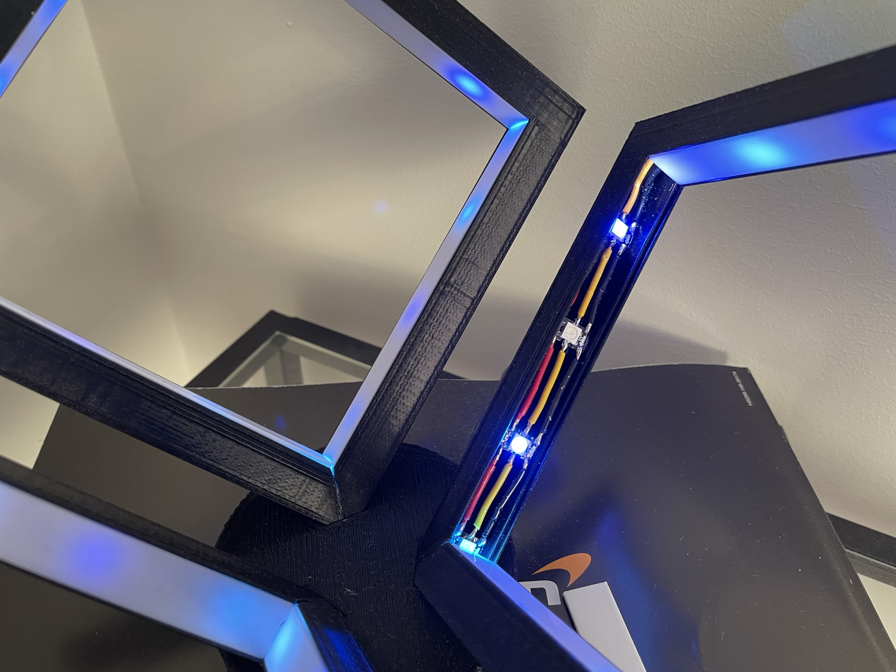
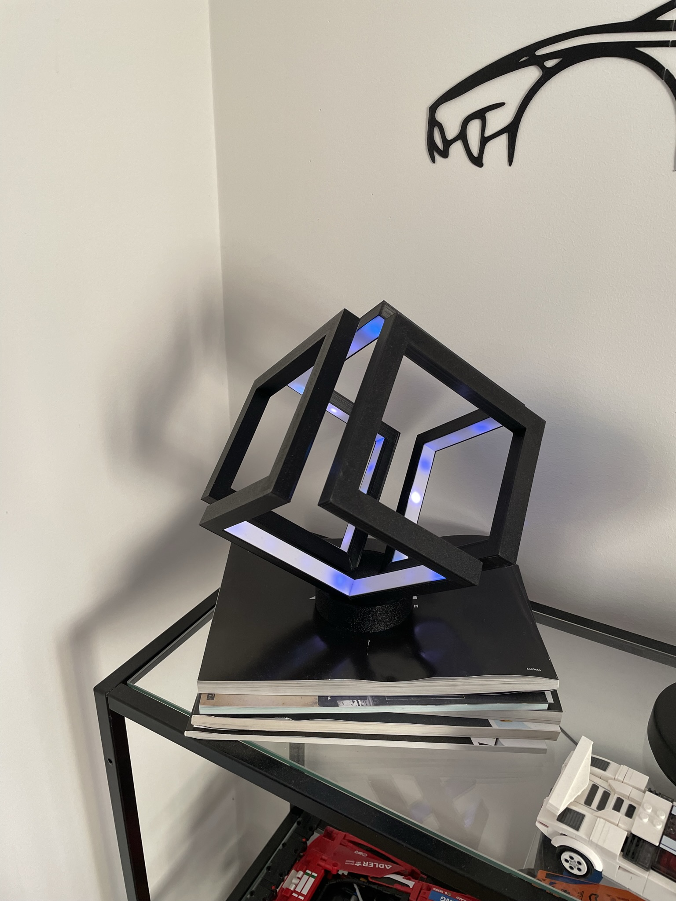
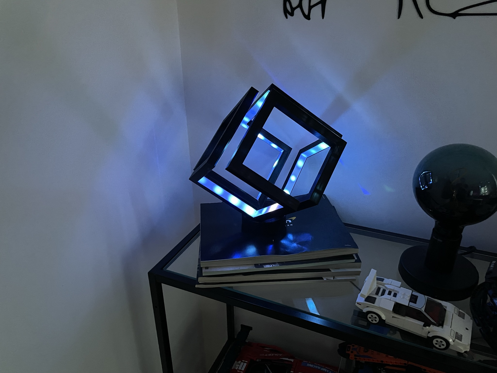

# Cube lamp

## Hardware
The LEDs used are just cheep WS2812B and they are connected to a Wemos D1 Mini

## Software
I use [WLED](https://kno.wled.ge/) for all my LED projects and this is no exception.

## Design

This is a redesign of [this](https://www.printables.com/model/41750-infinity-cube-light%2Fcomments)

I made my own design because I wanted to better my 3D modeling skills and I also though I could make the same final product with less filament and faster print times.

The 3D model is *very* similar to the original design but just a bit bigger and smaller walls.

But it was a good exercise to become better at fusion 360 and I kinda like the final product aswell.

At the time of building this I only had WS1812B strips with 144 ledss/m and juust sticking that into the frame would have made it like 150 leds and that was a bit too many for this project. So instead I separated each led and soldered them together with a few cm distance. This was just a cheep alternative since I had these leds but I would never make it like this again. Instead just buy 30 leds/m strip and connect them in the corners.

I printed the diffusers in white PLA but I think some sort of white plexi would have been better. The diffusion is not the best and that's partially because of the short distance between the leds and the diffuser but also the amout of leds used. It looks a bit better in person compared to on pictures when it comes to diffusion but there's still room for improvement. I also never have all the leds on at the same time, I instead have an animation running which hides this problem even more.

For future revisions I would test more before settling on the final design to make the leds look better and not make them as visable.

