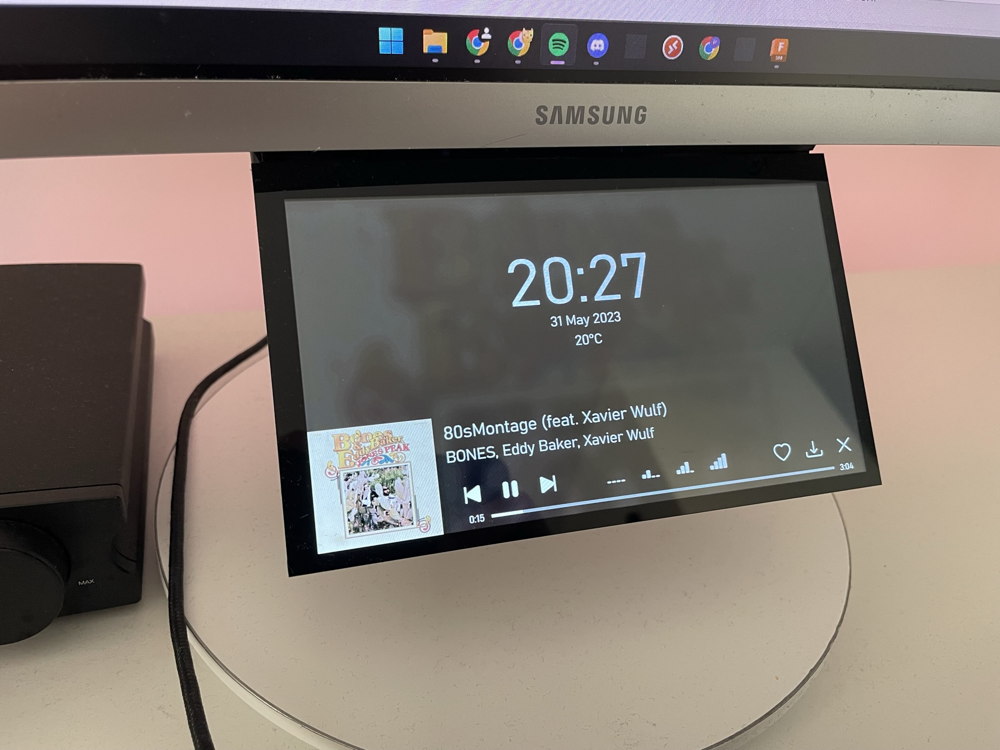
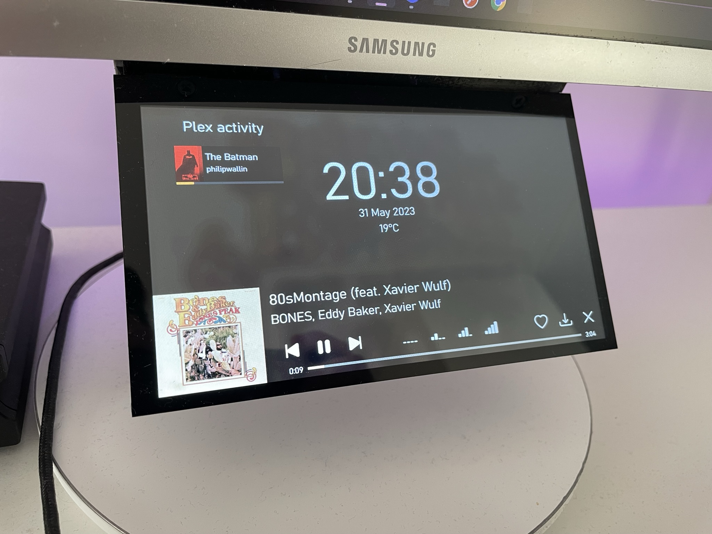
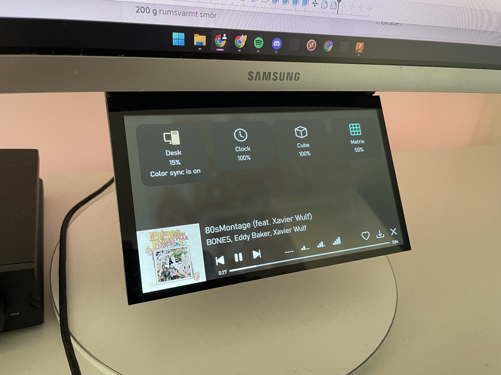

# Ingcool Second Display

## Hardware

The monitor used is [this](https://www.amazon.com/Ingcool-Resolution-Capacitive-Compatible-Raspberry/dp/B08H8HZRLQ) Ingcool 7 inch monitor.

The mount for the display is 3D printed and the model i quite simple and there's a bit of room for improvement to make the mount more hidden.

## Software

The sofware for this project is the same as for [this](https://github.com/philipwallin97/ProjectDocs/tree/main/Waveshare%20WLED%20Display) project.

It's a angular website running on another computer locally.

The code can be found [here](https://github.com/philipwallin97/Dashboard)

It's a quite simple application that mostly displays currently playing song on Spotify, if someone is using my Plex server and date/time/weather.

The upper part where the time / date / weather is shown is it's own section which you can swipe to the right to get to other functionality.

One of these are showing some of the WLEDs in the room and pressing the "Desk" icon toggles color sync. That takes the average color of the currently playing song from spotify and sets the leds behind the desk to that color.

The lower part that shows currently playing on Spotify is what started the project.
The buttons under the title / artist are divided into 3 segments.

Previous / Play / Pause / Next

Volume presets

Like song / Save song to a specified playlist / Remove from playlist