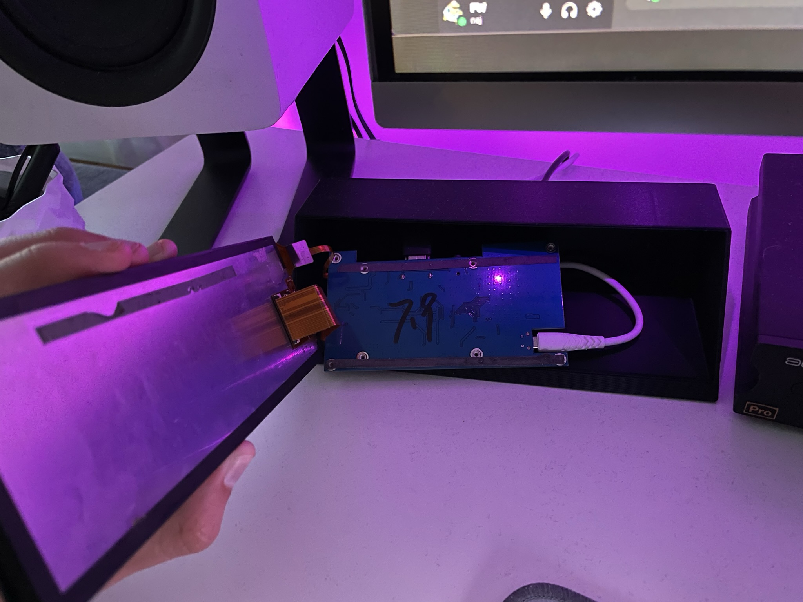
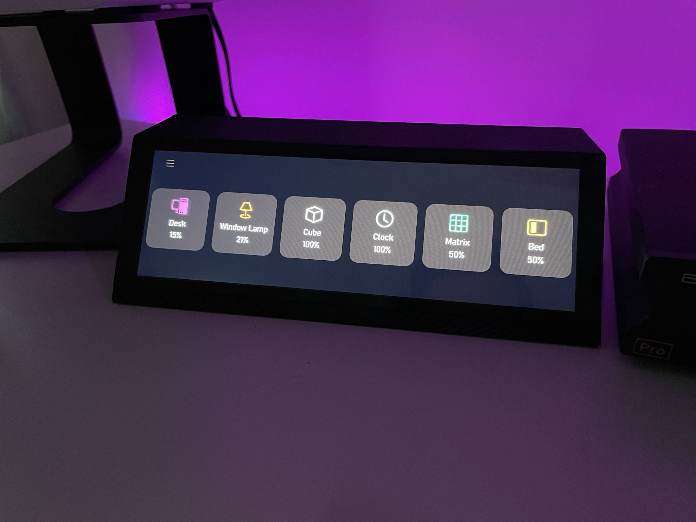
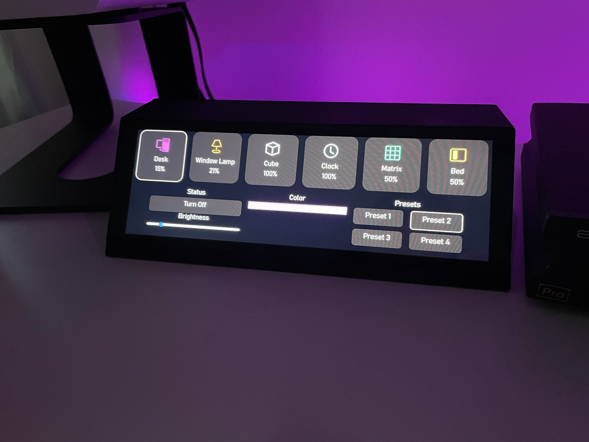

# Ingcool Second Display

## Hardware

The monitor used is [this](https://www.waveshare.com/wiki/7.9inch_HDMI_LCD) Waveshare 7.9 inch monitor.

The case is 3D printed and the monitor just slots into the front.

I had to remove the board from teh lcd in order to make it fit into the form factor i wanted.

## Software

The sofware for this project is the same as for [this](https://github.com/philipwallin97/ProjectDocs/tree/main/Waveshare%20WLED%20Display) project.

It's a angular website running on another computer locally.

The code can be found [here](https://github.com/philipwallin97/Dashboard)

The purpose of this display is to control all my WLED leds in my apartment.

It's shows an icon for each WLED and the color of the icon is decided by the current color of the WLED. Under the icon is the name specified for each WLED and also the current brightness.

Pressing any icon opens a more detailed view with more controls.

Here you can toggle on / off

Control the brightness

Control the color

Select between presets 1-4

Pressing the hamburger menu on the top left shows some more general buttons.

Here you can toggle all light on / off and set all WLED to their default presets.

I also have 2 other controlable leds that's not WLED and those can be toggled from here.