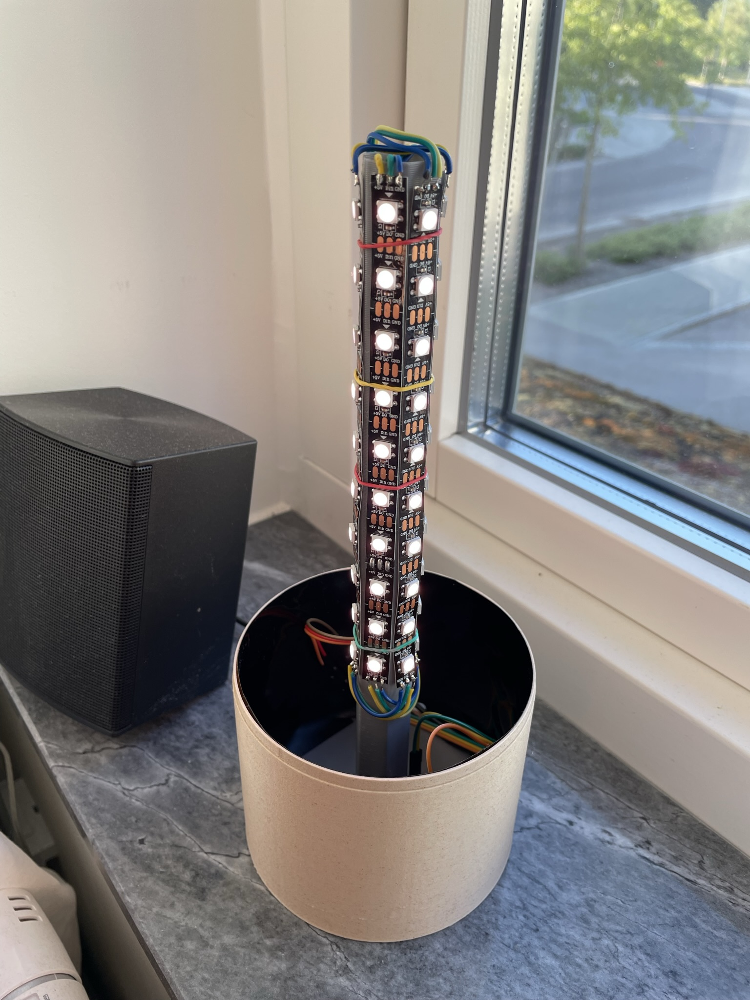
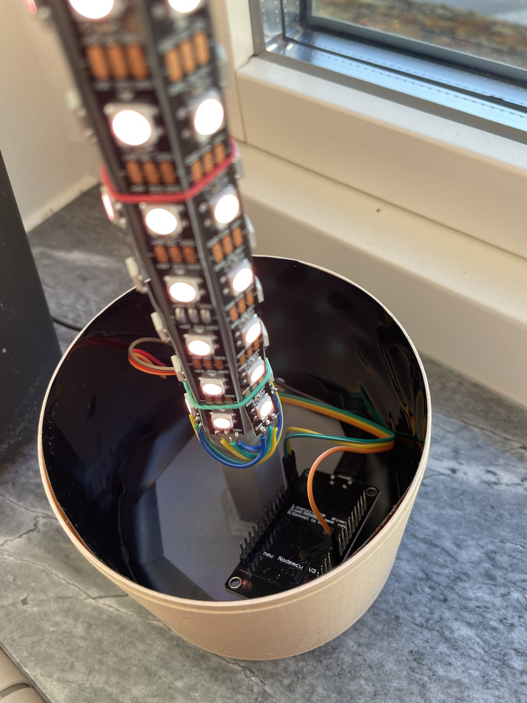
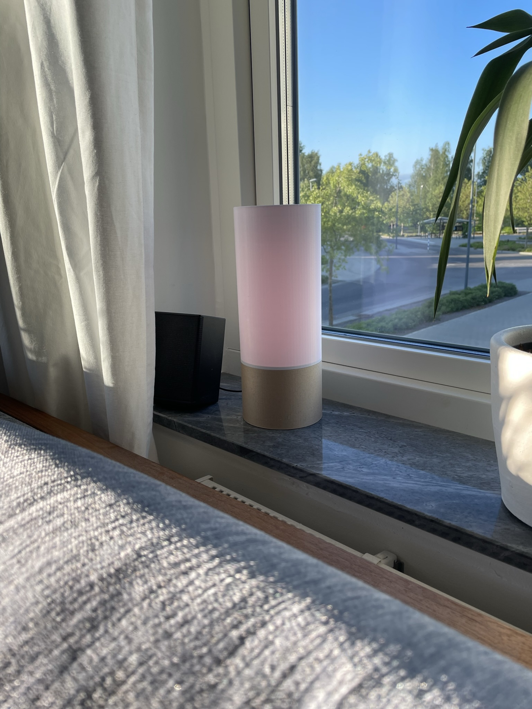

# Window lamp

## Hardware
The LEDs used are just cheep WS2812B and they are connected to a Wemos D1 Mini

## Software
I use [WLED](https://kno.wled.ge/) for all my LED projects and this is no exception.

## Design

I saw [this](https://www.printables.com/model/162361-maker-lamp) and wanted to make something similar but with WS2812B leds instead of a regular light bulb

I made the design into 3 pieces.

The bottom part that could be changed to any color in the future.

The middle part that holds all the leds.

The top part in white that diffuses the light

I used the glue on the back of the led strip to hold it in place at first but that glue is not strong enough and after just a few days the leds started to fall off from the center part. I then just added a few rubber bands and that worked great.

I have noticed it gets quite hot when having it on full brightness so that might be something to look out for so nothing bad happens but I usually run the lamp at 20% brightness so I haven't seen any problems at all.

The design was made to have 2 outer layers on the bottom part but that was not enough to stop the light in the base. I added some black tape on the inside in order to stop the light bleed there.

During the day you can barely see the light with my 20% brightness but that's not very surprising.

When it's a bit darker it works as expected. Worth mentioning is that it's more diffused in real life then on pictures.

